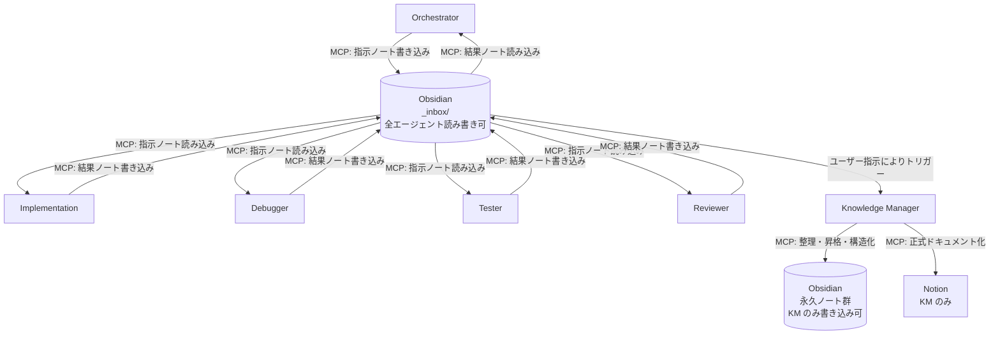

<!-- このファイルは、.github 配下のエージェント連携フローを定義するためのものです。 -->

<!-- 変更: 旧設計から Obsidian 根幹中継モデル（分散アクセス型）へ移行 -->

# .github エージェント連携フロー（Obsidian 根幹中継モデル）

## 連携原則

- エージェント間の直接通信を行わず、指示・中間ログ・結果はすべて Obsidian `_inbox/` を経由する。
- `_inbox/` は全エージェントが読み書き可能とする。
- Obsidian 永久ノート群は全エージェントが読み取り可能、書き込みは Knowledge Manager のみとする。
- Notion への正式ドキュメント化は Knowledge Manager のみが実行する。

## Git操作ルール

- 実装・修正・デバッグ・テストなど、1つのサブタスクが完了した段階で `git add -A && git commit -m "<type>: <summary>"` を実行する。
- commit は Implementation / Debugger / Tester が各自の担当作業完了時に行う。
- Orchestrator はフェーズ完了時にまとめて commit せず、各エージェントに委譲する。
- Reviewer / Knowledge Manager は原則 commit を行わない。
- 未完成・動作未確認・検証未通過の変更は commit しない。
- `git push` はユーザーの明示的許可がある場合のみ実行する。

## タスク完了時の標準出力フォーマット（全エージェント必須）

- 対象: `Orchestrator` / `Implementation` / `Debugger` / `Tester` / `Reviewer` / `Knowledge Manager`
- すべてのエージェントは、タスク完了時に以下 3 項目をこの順でユーザーへ返す。

1. **実行結果サマリー**
   - 実行したタスク概要と成果物を簡潔に記述する。
2. **Obsidian記録ステータス**
   - 記録したノートのパスとタイトルを明示する。
   - 例: `📝 記録先: /Projects/MyApp/tasks/2024-01-15-implementation.md`
3. **次に起動すべきエージェント（必須）**
   - 次に実行が必要なエージェントを 1 つ明示する。
   - 候補が複数ある場合は優先順位と理由を併記する。
   - 次エージェント向けの指示概要（Obsidian 記録内容の要約）と参照ノートを提示する。

出力テンプレート:

```markdown
▶ 次のエージェント: **[エージェント名]**
指示概要: [次エージェントが実行すべきタスクの要約]
参照ノート: [ObsidianノートのパスまたはURL]
```

- 後続タスクが存在しない場合は、次を明示する。
  - `✅ フロー終端: 後続エージェントの起動は不要です。`

## フロー図



## 補足

- ノート構造仕様は [.github/obsidian-structure.md](obsidian-structure.md) を参照する。
- ノート書き込みフォーマットは [.github/obsidian-note-format.md](obsidian-note-format.md) を参照する。
- MCP サーバー未設定時は、各エージェント定義の「MCP サーバー未設定時の扱い」に従い、コメント明記のうえ当該操作をスキップする。
