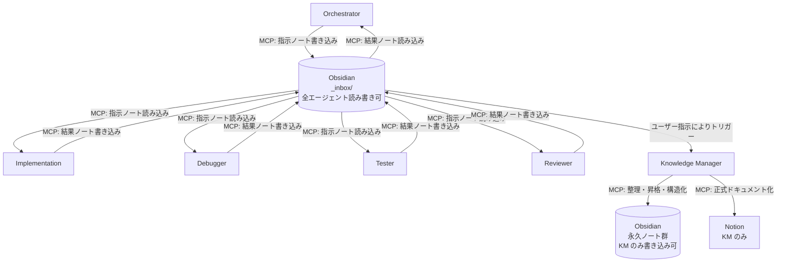

<!-- このファイルは、.github 配下のエージェント連携フローを定義するためのものです。 -->

<!-- 変更: 旧設計から Obsidian 根幹中継モデル（分散アクセス型）へ移行 -->

# .github エージェント連携フロー（Obsidian 根幹中継モデル）

## 連携原則

- エージェント間の直接通信を行わず、指示・中間ログ・結果はすべて Obsidian `_inbox/` を経由する。
- `_inbox/` は全エージェントが読み書き可能とする。
- Obsidian 永久ノート群は全エージェントが読み取り可能、書き込みは Knowledge Manager のみとする。
- Notion への正式ドキュメント化は Knowledge Manager のみが実行する。

## フロー図

## 補足

- ノート構造仕様は [.github/obsidian-structure.md](obsidian-structure.md) を参照する。
- ノート書き込みフォーマットは [.github/obsidian-note-format.md](obsidian-note-format.md) を参照する。
- MCP サーバー未設定時は、各エージェント定義の「MCP サーバー未設定時の扱い」に従い、コメント明記のうえ当該操作をスキップする。
