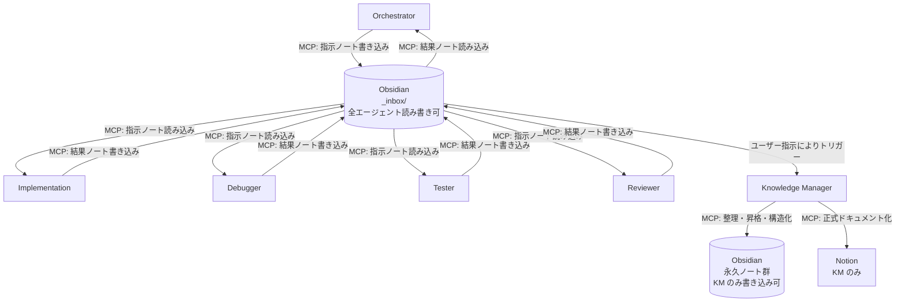

# .github エージェント設定の設計変更指示

## 本指示の位置づけ

本指示は既存設計の部分追記ではなく、エージェント連携アーキテクチャ全体の設計変更である。
既存ルールとの競合が発生した場合は、本指示の内容を優先し、既存ルールを上書き・修正してよい。
ただし、各エージェントの「役割・責務の定義」そのものは変更しないこと。

---

## 既存エージェント構成（役割定義は維持）

- **Orchestrator**: タスク分解・フロー制御・各エージェントへの指示生成
- **Implementation**: 実装・コメント作成・簡易リファクタ
- **Debugger**: エラー解析・原因特定・修正案提示
- **Tester**: テストケース作成・実行・バグ検出
- **Reviewer**: コードレビュー・設計チェック・品質評価
- **Knowledge Manager**: Obsidian 全体の管理・整理、Notion への正式ドキュメント化

---

## 設計変更の概要

### 旧設計（廃止）

Orchestrator が各エージェントへ直接・自動的に指示を出すアーキテクチャ。
VSCode / GitHub Copilot の制約上、エージェント間の自動連携が不可能なため全廃する。

### 新設計：Obsidian 根幹中継モデル（分散アクセス型）

エージェント同士は直接通信しない。
すべての指示・判断・知識・実行結果は Obsidian を経由する。

Obsidian へのアクセス権はエージェントの用途に応じて以下のとおり分離する。

| アクセス対象                                                                                                        | 読み取り               | 書き込み               |
| ------------------------------------------------------------------------------------------------------------------- | ---------------------- | ---------------------- |
| Obsidian `_inbox/`（一時ノート）                                                                                    | 全エージェント         | 全エージェント         |
| Obsidian 永久ノート（`agent-rules/` `implementation-log/` `debug-log/` `review-log/` `agent-feedback/` `archive/`） | 全エージェント         | Knowledge Manager のみ |
| Notion（正式ドキュメント）                                                                                          | Knowledge Manager のみ | Knowledge Manager のみ |

この設計により、各エージェントは KM を介さず自律的に `_inbox/` を読み書きできる。
一方、知識の永久保存・正式化・Notion への昇格は KM が一元管理し、品質と一貫性を担保する。

開発フローは以下のループで進行する。

```
[Orchestrator]
  → MCP で Obsidian _inbox/orchestrator-tasks/ に指示ノートを書き込む
      ↓
[Implementation / Debugger / Tester / Reviewer]
  → MCP で Obsidian _inbox/ の自分宛て指示ノートを読み込む
  → タスク実行（実行中も随時 _inbox/ に中間ログを書き込む）
  → MCP で Obsidian _inbox/[agent-name]-results/ に結果ノートを書き込む
      ↓
[Orchestrator]
  → MCP で結果ノートを読み込む → 次の指示を生成
      ↓
（以降ループ）
      ↓
[Knowledge Manager]（ユーザーの指示に基づきトリガー）
  → _inbox/ を精査し、永久ノートへ昇格・整理・アーカイブを実行
  → 必要に応じて Notion へ正式ドキュメントとして書き込む
  → 完全に不要と判断した記録のみ削除する
```

---

## 根幹ルール（全エージェント共通・最優先）

以下を全エージェントの instruction の冒頭に配置し、既存の同種ルールと競合する場合は既存記述を本ルールで置き換えること。

### 必須事項

- すべてのタスク着手前に、MCP 経由で Obsidian の該当ノートを読み込むこと。
- すべてのタスク・指示・判断・実行結果・知識・気づきは、MCP 経由で Obsidian の所定ノートに書き込むこと。
- Obsidian への書き込みはタスク完了後だけでなく、実行中も随時行うこと（途中経過・判断ログも記録対象）。
- ローカルファイルシステムへの `.md` ファイル直接書き込みは行わないこと。Obsidian・Notion への実際の書き込みは MCP ツール経由のみとすること。

### 禁止事項

- **エージェント間の直接指示・直接通信を禁止する。** Obsidian を介さずに他エージェントへ指示・依頼・情報伝達を行ってはならない。
- **永久ノートへの直接書き込みを禁止する（KM を除く）。** `agent-rules/` `implementation-log/` `debug-log/` `review-log/` `agent-feedback/` `archive/` への書き込みは KM のみが行う。
- **Notion への直接アクセスを禁止する（KM を除く）。** 正式ドキュメント化・Notion への書き込みは KM のみが行う。
- **書き込みの省略を禁止する。** タスクの規模・自明性を理由とした省略は認めない。
- **チャット・口頭上のみでの完結を禁止する。** ユーザーとのやり取りで決定した事項も必ず Obsidian に転記すること。
- **前回の結果ノートを読まずに次の指示を生成することを禁止する。** Orchestrator は必ず直前の結果ノートを確認してから次のタスクを生成すること。
- **セッション終了時に知識を書き出さないことを禁止する。** 判断根拠・気づきはセッション終了前に必ず Obsidian へ書き出すこと。

---

## 変更作業の詳細

### 1. Knowledge Manager の instruction を再定義する

KM の instruction に競合する既存記述がある場合は上書きして以下の内容に変更すること。

#### Knowledge Manager の責務（変更後）

KM は Obsidian 全体の品質管理者であり、正式知識の門番として機能する。具体的な責務は以下のとおり。

**通常運用（常時）**

- `_inbox/` 配下の一時ノートを監視し、永久ノートへ昇格すべき内容を識別する。
- 永久ノートへの昇格時は、情報を整理・タグ付け・相互リンクしたうえで書き込む。
- 完了・確定した内容を MCP 経由で Notion へ正式ドキュメントとして書き込む。

**整理モード（ユーザーの明示的な指示によりトリガー）**

- Obsidian 内の全記録を構造的観点からレビューし、以下の処理を行う。
  - 重複・断片化したノートの統合。
  - フォルダ構造の最適化と誤配置ノートの移動。
  - 陳腐化したリンク・参照の修正。
  - 開発に必要なルール・タスク・メモ・ログは削除しないこと。
  - 完全に不要であることが明確な記録（完了済みで永久ノートに昇格済みの inbox ノート、重複が解消されたコピーなど）のみを削除すること。
- 削除する記録は事前にリストアップし、ユーザーの確認を得てから実行すること。

**アクセス権限**

- Obsidian 全フォルダ（読み取り・書き込み）: `obsidian` MCP サーバー経由
- Notion（読み取り・書き込み）: `notion` MCP サーバー経由

---

### 2. 各エージェントの instruction を変更する

競合する既存記述は削除または上書きすること。

#### Orchestrator

- タスク分解後、他エージェントへ直接指示を出す記述があれば削除し、以下に置き換える。
  - MCP 経由で `_inbox/orchestrator-tasks/` へ指示ノートを書き込む。
  - 次のタスク生成前に、MCP 経由で直前の結果ノートを読み込む。
  - 書き込みフォーマットは `obsidian-note-format.md` に従う。
- 永久ノートへの直接書き込みは行わないこと（根幹ルール・禁止事項参照）。

#### Implementation / Debugger / Tester / Reviewer（共通）

- タスク開始前に MCP 経由で `_inbox/` の自分宛て指示ノートを読み込む。
- タスク実行中も随時 `_inbox/` に中間ログを書き込む。
- タスク実行後、MCP 経由で `_inbox/[agent-name]-results/` に結果ノートを書き込む。
- 書き込みフォーマットは `obsidian-note-format.md` に従う。
- 永久ノートへの直接書き込みは行わないこと（根幹ルール・禁止事項参照）。

---

### 3. Obsidian のディレクトリ構造定義ファイルを作成する

`.github/obsidian-structure.md` を新規作成すること。
このファイルはローカルに置く構造仕様メモであり、Obsidian 本体へのフォルダ・ファイルの実体作成は行わないこと。

```
# Obsidian ノート構造定義（仕様メモ）
# 実際のノート作成・管理は MCP 経由で行う。ローカルへの直接書き込みは禁止。

obsidian/
│
├── _inbox/                        # 【一時】エージェント間の受け渡し用（全エージェントが読み書き可）
│   ├── orchestrator-tasks/        # Orchestrator が書いたタスク指示ノート
│   ├── implementation-results/    # Implementation の実行結果ノート
│   ├── debugger-results/          # Debugger の解析結果ノート
│   ├── tester-results/            # Tester の実行結果ノート
│   └── reviewer-results/          # Reviewer のレビュー結果ノート
│
├── agent-rules/                   # 【永久】エージェントの根幹ルール・動作定義（KM のみ書き込み可）
│   ├── orchestrator.md
│   ├── implementation.md
│   ├── debugger.md
│   ├── tester.md
│   ├── reviewer.md
│   └── knowledge-manager.md
│
├── implementation-log/            # 【永久】実装記録（KM のみ書き込み可）
│   └── YYYY-MM-DD_[feature-name].md
│
├── debug-log/                     # 【永久】デバッグ記録（KM のみ書き込み可）
│   └── YYYY-MM-DD_[error-summary].md
│
├── review-log/                    # 【永久】レビュー指摘・改善提案（KM のみ書き込み可）
│   └── YYYY-MM-DD_[review-target].md
│
├── agent-feedback/                # 【永久】AIエージェントへの指摘・改善メモ（KM のみ書き込み可）
│   └── YYYY-MM-DD_[agent-name]-feedback.md
│
└── archive/                       # 【永久】完了・クローズした inbox ノートの保管（KM のみ書き込み可）
    └── YYYY-MM/
```

#### ノート分類ルール

| 分類             | フォルダ              | 保持期間               | 読み取り権限   | 書き込み権限   |
| ---------------- | --------------------- | ---------------------- | -------------- | -------------- |
| 一時ノート       | `_inbox/`             | KM が整理するまで      | 全エージェント | 全エージェント |
| 根幹ルール       | `agent-rules/`        | 永久（追記・修正のみ） | 全エージェント | KM のみ        |
| 実装記録         | `implementation-log/` | 永久                   | 全エージェント | KM のみ        |
| デバッグ記録     | `debug-log/`          | 永久                   | 全エージェント | KM のみ        |
| レビュー指摘     | `review-log/`         | 永久                   | 全エージェント | KM のみ        |
| エージェント指摘 | `agent-feedback/`     | 永久                   | 全エージェント | KM のみ        |
| アーカイブ       | `archive/`            | 永久（参照専用）       | 全エージェント | KM のみ        |

---

### 4. Obsidian ノートの書き込みフォーマット定義ファイルを作成する

`.github/obsidian-note-format.md` を新規作成すること。
このファイルもローカルに置く仕様メモであり、実体ファイルではない。

#### 一時ノート：指示ノート（`_inbox/orchestrator-tasks/`）

```markdown
---
type: task-instruction
created: { { YYYY-MM-DD HH:mm } }
orchestrator-session: { { セッションID } }
target-agent: { { Implementation | Debugger | Tester | Reviewer } }
status: pending
---

## タスク概要

{{タスクの概要}}

## 詳細指示

{{具体的な実行内容}}

## 完了条件

{{何をもって完了とするか}}

## 参照ノート

{{関連する永久ノートへのリンク（あれば）}}
```

#### 一時ノート：結果ノート（`_inbox/[agent-name]-results/`）

```markdown
---
type: task-result
created: { { YYYY-MM-DD HH:mm } }
agent: { { エージェント名 } }
linked-instruction: { { 対応する指示ノートのパス } }
status: completed | blocked | partial
---

## 実行結果サマリー

## 成果物・変更内容

## 未解決事項・懸念点

## 次のエージェントへの引き継ぎ事項
```

#### 永久ノート：実装記録（`implementation-log/`）

```markdown
---
type: implementation-log
date: { { YYYY-MM-DD } }
feature: { { 機能名 } }
linked-inbox: { { 元になった inbox ノートのパス } }
---

## 実装概要

## 変更ファイル一覧

## 設計上の判断・理由

## 残課題
```

#### 永久ノート：デバッグ記録（`debug-log/`）

```markdown
---
type: debug-log
date: { { YYYY-MM-DD } }
error-summary: { { エラーの一言要約 } }
linked-inbox: { { 元になった inbox ノートのパス } }
---

## 発生したエラー・事象

## 原因分析

## 修正内容

## 再発防止策
```

#### 永久ノート：エージェント指摘（`agent-feedback/`）

```markdown
---
type: agent-feedback
date: { { YYYY-MM-DD } }
target-agent: { { エージェント名 } }
severity: low | medium | high
---

## 指摘内容

## 発生したコンテキスト

## 改善提案

## 対応状況
```

---

### 5. AGENTS.md を作成・更新する

`.github/AGENTS.md`（存在しない場合は新規作成）に新設計のフローを記述すること。
既存の連携フロー図・記述がある場合は削除して本内容で置き換えること。



---

## 作業上の制約・注意事項

1. **本指示は追記ではなく設計変更である。** 競合する既存記述は上書き・削除してよい。
2. 変更・削除した箇所には `<!-- 変更: 旧設計から Obsidian 根幹中継モデル（分散アクセス型）へ移行 -->` コメントを残すこと。
3. 変更しないのは各エージェントの「役割・責務定義」のみ。連携方法・アクセス権・禁止事項はすべて本指示に従うこと。
4. `.github/obsidian-structure.md` および `.github/obsidian-note-format.md` はローカルに置く仕様メモであり、Obsidian 本体へのフォルダ・ファイルの実体作成は行わないこと。
5. Obsidian・Notion への実際の書き込み・読み込みはすべて MCP ツール経由のみとし、ローカルファイルシステムへの `.md` ファイル直接書き込みは行わないこと。
6. MCP サーバー（`obsidian`・`notion`）が未設定の場合は、その旨をコメントで明記し、設定が完了するまで当該操作をスキップする処理を記述すること。
7. KM の整理モードは、ユーザーの明示的な指示なしに自律起動しないこと。また削除実行前に必ず削除対象のリストをユーザーへ提示し、承認を得てから実行すること。
