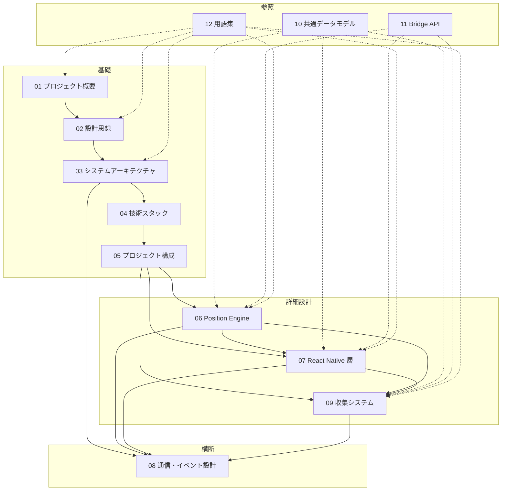

# 00. 設計書インデックス

## 本書について

本書は FrontierAtlas 屋内測位システムの全設計書のインデックスである。各ドキュメントの要約・依存関係・推奨読込順を提供する。

---

## ドキュメントマップ

| # | ドキュメント | 種別 | 概要 |
|---|------------|------|------|
| 00 | 設計書インデックス | メタ | 本書 |
| 01 | プロジェクト概要 | 概要 | プロジェクトの目的・研究背景・基本設計思想 |
| 02 | 設計思想・基本原則 | 基礎 | 全設計判断の土台となる原則・責務分離・レイヤ構造 |
| 03 | システム全体アーキテクチャ | 基礎 | 6層アーキテクチャ・コンポーネント責務・データフロー |
| 04 | 技術スタック | 基礎 | 採用技術一覧（React Native / Kotlin / MapLibre / GeoJSON / QGIS） |
| 05 | プロジェクト構成 | 基礎 | マルチレポ構成・Map Assets Pipeline |
| 06 | Android Position Engine | 詳細 | 測位エンジン全体設計（6サブレイヤの親ドキュメント） |
| 06a | Sensor Layer | 詳細 | センサー取得・正規化・バッテリー最適化 |
| 06b | PDR Engine | 詳細 | 歩行検出・歩幅推定・Heading推定・ドリフト管理 |
| 06c | Fingerprint Engine | 詳細 | Wi-Fi/地磁気 Fingerprint 照合・候補位置生成 |
| 06d | Position Fusion Engine | 詳細 | 複数測位結果の統合・Confidenceベース重み付け |
| 06e | Indoor Map Matching Engine | 詳細 | 建物構造制約による位置補正 |
| 06f | Event Engine | 詳細 | イベント駆動通知・差分検出・抑制制御 |
| 07 | React Native アプリケーション層 | 詳細 | UIレイヤ構成・MapLibre連携・Camera制御 |
| 07a | Mobile ソースコード構造 | 詳細 | `mobile/src/` の7レイヤ構成と各ディレクトリ責務 |
| 08 | 通信・イベント設計 | 横断 | システム全体の通信方式・イベント分類・非同期設計 |
| 09 | Fingerprint Collection System | 詳細 | 収集システム全体設計（収集モード/測位モード） |
| 09a | Collection Engine | 詳細 | Android Native 収集エンジン・データモデル・SQLiteスキーマ |
| 09b | Collection UI | 詳細 | React Native 収集UI・Graphレイヤ・タップ判定 |
| 09c | Fingerprint DB Pipeline | 詳細 | 収集データ→Fingerprint DB 変換パイプライン |
| 10 | 共通データモデル | 参照 | Confidence型・GraphPosition型・イベントペイロード型の一元定義 |
| 11 | Bridge API リファレンス | 参照 | PositionEngine API / AssetService API の完全仕様 |
| 12 | 用語集 | 参照 | プロジェクト固有用語の定義 |

---

## 推奨読込順

```text
【初回読込者】
  00 インデックス（本書）
  → 01 プロジェクト概要
    → 02 設計思想・基本原則
      → 03 システム全体アーキテクチャ
        → 04 技術スタック
          → 05 プロジェクト構成
            → 【先読み推奨】10 共通データモデル §2「Confidence」
              → 06 Position Engine（+ 06a〜06f）
                → 07 React Native 層（+ 07a）
                  → 08 通信・イベント設計
                    → 09 収集システム（+ 09a〜09c）

【リファレンス利用】
  10 共通データモデル（§2以外）/ 11 Bridge API リファレンス / 12 用語集
  は必要に応じて随時参照。
```

---

## ドキュメント間依存関係



---

## 図表の共通凡例

各ドキュメント内の図表で使用される記法：

| 記法 | 意味 |
|------|------|
| `→` | データの流れ / 処理の順序 |
| `⇒` | 非同期処理の流れ |
| `◄─►` | 双方向通信 |
| `┌──┐` 等 | コンポーネント境界 |
| `【】` | 通信方向ラベル |

---

## 変更履歴

| 日付 | 変更内容 |
|------|---------|
| 2026-07-24 | 初版作成。設計書構造の再編成に伴い新設 |
| 2026-07-24 | 設計書レビューに基づく改善：05 §4 完成、07 §6 ナンバリング修正、01/03 座標系重複解消、02 タイトル統一、06f/08 責務境界明示、読込順・依存関係図 更新 |
